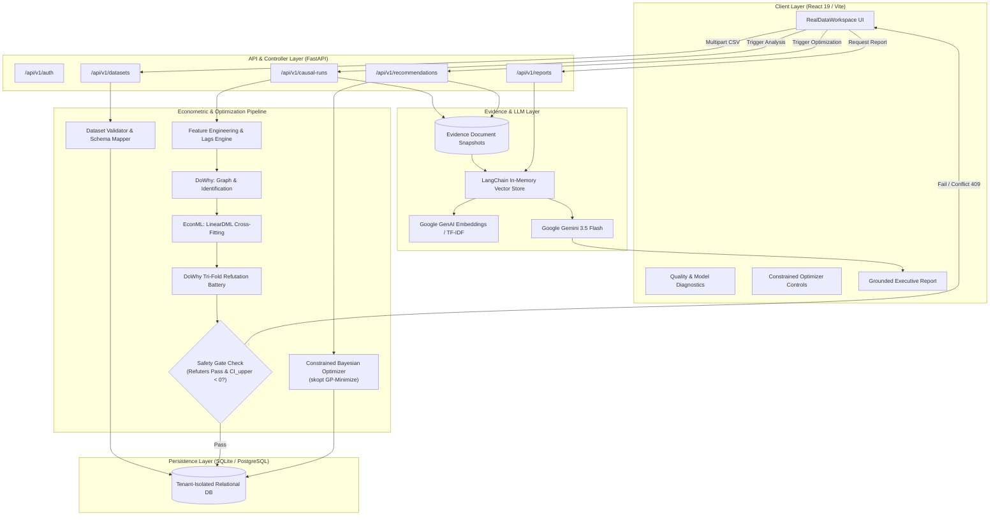
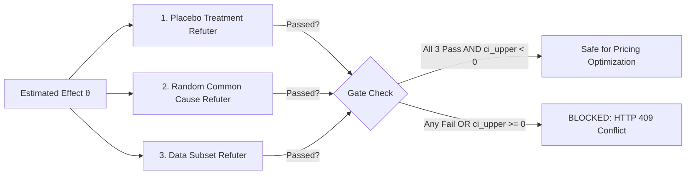

# LLM-DPECI: LLM-Powered Dynamic Pricing Engine with Causal Inference

[](https://www.python.org/)
[](https://fastapi.tiangolo.com/)
[](https://react.dev/)
[](https://vitejs.dev/)
[](https://py-why.github.io/dowhy/)
[](https://econml.azurewebsites.net/)
[](https://ai.google.dev/)
[](LICENSE)

An enterprise-grade, evidence-grounded dynamic pricing decision engine for retail and e-commerce. **LLM-DPECI** bridges econometric causal inference, Bayesian optimization, and Large Language Models: it estimates unconfounded price elasticities via **DoWhy** and **EconML Double Machine Learning (LinearDML)**, optimizes safe gross-profit margins within rigid business guardrails via **Gaussian Process optimization**, and synthesizes auditable executive explanations using **Gemini RAG (Retrieval-Augmented Generation)** grounded strictly in verified statistical evidence.

---

## Table of Contents

- [1. Executive Summary & Core Principles](#1-executive-summary--core-principles)
- [2. The Endogeneity Problem in Retail Pricing](#2-the-endogeneity-problem-in-retail-pricing)
- [3. End-to-End System Architecture](#3-end-to-end-system-architecture)
- [4. Multi-Tenant Isolation & Audit Trail](#4-multi-tenant-isolation--audit-trail)
- [5. Deep-Dive: Causal Inference Engine (DoWhy + EconML)](#5-deep-dive-causal-inference-engine-dowhy--econml)
  - [Causal Graph & Structural Identification](#causal-graph--structural-identification)
  - [Bad Controls Exclusion](#bad-controls-exclusion)
  - [Double Machine Learning (DML) Formulation](#double-machine-learning-dml-formulation)
  - [Tri-Fold Robustness Refutations (Safety Gates)](#tri-fold-robustness-refutations-safety-gates)
- [6. Deep-Dive: Constrained Bayesian Profit Optimization](#6-deep-dive-constrained-bayesian-profit-optimization)
  - [Causal Demand & Profit Formulation](#causal-demand--profit-formulation)
  - [Business Guardrails & Bounding Floors](#business-guardrails--bounding-floors)
- [7. Deep-Dive: Grounded Gemini RAG Layer](#7-deep-dive-grounded-gemini-rag-layer)
  - [Decoupling Computation from Explanation](#decoupling-computation-from-explanation)
  - [Dual-Mode Semantic Vector Retrieval](#dual-mode-semantic-vector-retrieval)
  - [Strict Hallucination Prevention](#strict-hallucination-prevention)
- [8. Data Contract & Ingestion Schema](#8-data-contract--ingestion-schema)
- [9. Technology Stack](#9-technology-stack)
- [10. Installation & Quickstart](#10-installation--quickstart)
  - [Prerequisites](#prerequisites)
  - [Environment Configuration](#environment-configuration)
  - [Backend Setup (with Windows Path Resolution)](#backend-setup-with-windows-path-resolution)
  - [Frontend Setup](#frontend-setup)
- [11. Interactive Demonstration Walkthrough](#11-interactive-demonstration-walkthrough)
- [12. REST API Reference](#12-rest-api-reference)
- [13. Testing & Verification Suite](#13-testing--verification-suite)
- [14. Production Hardening & Enterprise Roadmap](#14-production-hardening--enterprise-roadmap)

---

## 1. Executive Summary & Core Principles

Modern retail pricing strategies frequently stumble over a critical hurdle: observational price and sales data are riddled with **confounders**. Standard machine learning approaches maximize associative patterns rather than interventional causality, while unconstrained LLMs hallucinate numbers and lack mathematical accountability.

**LLM-DPECI** enforces four core engineering principles:

1. **Zero Data Fabrication**: We strictly reject synthetic confounders or hallucinated weather/event values. Causal models run exclusively on authorized, validated historical data.
2. **Causal Gates Before Optimization**: An algorithm should never recommend price changes based on an unstable or ambiguous model. We run 3 econometric refutation tests and require a strictly negative confidence interval ($CI_{\text{upper}} < 0$) before permitting optimization.
3. **Hard Mathematical Guardrails**: Profit optimization takes place inside bounded constraint sets (margin floors, price volatility bands, and competitor undercut limits) to protect brand equity and avoid destructive price wars.
4. **LLM as Auditor, Not Decision-Maker**: Gemini is strictly prohibited from calculating or modifying prices. It operates downstream as a Retrieval-Augmented Generation (RAG) assistant, converting verified causal diagnostics, optimizer constraints, and data-quality metrics into natural-language briefings.

---

## 2. The Endogeneity Problem in Retail Pricing

In observational retail data, price ($P$) is not assigned randomly. Retailers lower prices during clearance events, holidays, or promotional blitzes, while raising prices during peak demand periods or supply shortages:

```text
                  ┌──────────────────────────────────────────────┐
                  │ Confounders (W)                              │
                  │ (Promotions, Seasonality, Stock, Events)     │
                  └──────────────┬────────────────┬──────────────┘
                                 │                │
                                 ▼                ▼
                           ┌───────────┐    ┌───────────┐
                           │ Price (T) │───▶│ Sales (Y) │
                           └───────────┘    └───────────┘
```

A naive regression or deep neural network analyzing raw $(P, Y)$ tuples conflates the price reduction with the promotional lift, concluding that demand was driven entirely by price. This causes **simultaneity and omitted-variable bias**.

### Associative Prediction vs. Interventional Causality

| Dimension | Standard Predictive ML / LLMs | LLM-DPECI Causal Framework |
| :--- | :--- | :--- |
| **Target Question** | *"What was demand when price happened to be \$20?"* | *"What will happen to demand if we intervene and set price to \$20?"* |
| **Statistical Quantity** | Conditional Expectation: $\mathbb{E}[Y \mid P=p]$ | Interventional Distribution: $\mathbb{E}[Y \mid \text{do}(P=p)]$ |
| **Confounding Handling** | Conflates price with seasonal spikes and promotions | Orthogonalizes treatment and outcome via Double Machine Learning |
| **Risk Profile** | High: Recommends aggressive discounting that destroys margin | Low: Mathematically bounded with refutation stress-testing |

---

## 3. End-to-End System Architecture



---

## 4. Multi-Tenant Isolation & Audit Trail

Every transaction in LLM-DPECI is isolated by **Retailer Workspace**. A tenant-aware relational architecture guarantees that sales observations, causal runs, and pricing recommendations are strictly compartmentalized and fully auditable:

```text
Retailer (Tenant)
  │
  ├── UserRetailer (Membership & Roles)
  │
  └── DatasetUpload (Source CSV, Row Hashes & Validation Quality Metrics)
        │
        └── Product (Catalog SKU)
              │
              ├── SalesObservation (Daily Transaction: Price, Demand, Cost, Context)
              │
              └── ModelRun (Causal Estimand, Graph JSON, LinearDML Effect, 3x Diagnostics)
                    │
                    └── Recommendation (Optimal Price, Bounds, Expected Profit vs Current)
                          │
                          └── EvidenceDocument (Immutable Snapshots -> Vector Store RAG)
```

**Traceability Guarantee**: For any live recommendation, an enterprise auditor can query backwards through the primary foreign-key chain to inspect the exact dataset upload ID, feature panel parameters, causal estimand graph, and refutation test statistics that produced the price.

---

## 5. Deep-Dive: Causal Inference Engine (DoWhy + EconML)

The causal engine lives in [`backend/services/causal_estimation.py`](file:///c:/Users/haris/OneDrive/Pictures/Desktop/ALL%20FOlDERS%20HERE/projects%20works/go%20In/LLM-Powered-Dynamic-Pricing-Engine-with-Causal-Inference-for-Retail-and-E-Commerce/backend/services/causal_estimation.py). It combines the structural causal modeling of **DoWhy** with the high-dimensional orthogonalization of **EconML**.

### Causal Graph & Structural Identification

1. **Treatment ($T$)**: `price`
2. **Outcome ($Y$)**: `units_sold`
3. **Common Causes / Confounders ($W$)**: Day of week, month, day of year, 1-day lagged demand (`lagged_demand_1`), 7-day lagged demand (`lagged_demand_7`), inventory levels, promotions, advertising spend, weather severity, and event proximity.
4. **Effect Modifiers ($X$)**: Categorical subsets (`promotion`, `store_id`, `channel`, `category`, `customer_segment`) used to evaluate heterogeneous treatment effects (HTE).

```python
model = CausalModel(
    data=panel,
    treatment="price",
    outcome="units_sold",
    common_causes=common_causes,
    effect_modifiers=effect_modifiers,
)
identified_estimand = model.identify_effect(proceed_when_unidentifiable=True)
```

### Bad Controls Exclusion

> [!WARNING]
> Controlling for variables directly downstream or collinear with the treatment creates mediator bias or severe multicollinearity.

The engine explicitly purges `relative_price_index` ($\frac{\text{price}}{\text{median\_price}}$) and `competitor_price_ratio` ($\frac{\text{price}}{\text{competitor\_price}}$) from DoWhy's common causes ($W$). Because both features are deterministic transformations of the treatment itself, including them violates backdoor identification criteria. The raw `competitor_price` is retained as an independent control.

### Double Machine Learning (DML) Formulation

To escape functional-form misspecification without falling victim to the curse of dimensionality, we employ **LinearDML** (Chernozhukov et al.):

1. **Nuisance Model $Y$**: Fit a flexible non-parametric regressor (Random Forest, 100 trees) to predict units sold from confounders:
   $$\hat{Y} = \mathbb{E}[Y \mid W]$$
2. **Nuisance Model $T$**: Fit a flexible non-parametric regressor (Random Forest, 100 trees) to predict price from confounders:
   $$\hat{T} = \mathbb{E}[T \mid W]$$
3. **Orthogonal Residualization**: Compute residual demand ($\tilde{Y} = Y - \hat{Y}$) and residual price ($\tilde{T} = T - \hat{T}$).
4. **Cross-Fitting (3-Fold)**: The dataset is split into 3 folds. Nuisance models trained on fold $k^c$ predict residuals on held-out fold $k$, completely purging regularization and sample-splitting bias.
5. **Final Estimation**: Regress residual demand onto residual price:
   $$\tilde{Y} = \theta(X) \cdot \tilde{T} + \epsilon, \quad \mathbb{E}[\epsilon \mid W] = 0$$

Here, $\theta$ represents the **marginal price effect**: the change in units sold per currency unit change in price ($\frac{\Delta \text{Units}}{\Delta \text{Price}}$).

### Tri-Fold Robustness Refutations (Safety Gates)

Before accepting the estimate, the model must pass three automated DoWhy refutation tests ($N=15$ simulations each):



1. **Placebo Treatment Refuter**: Permutes the price vector randomly. The artificial placebo effect must be strictly weaker than the true observed effect:
   $$| \theta_{\text{placebo}} | < | \theta_{\text{observed}} |$$
2. **Random Common Cause Refuter**: Injects an independent synthetic standard-normal variable into $W$ and re-estimates the effect. The effect shift must not exceed 60%:
   $$\frac{|\theta_{\text{new}} - \theta_{\text{observed}}|}{\max(|\theta_{\text{observed}}|, 10^{-8})} \le 0.60$$
3. **Data Subset Refuter**: Randomly samples 80% of historical observations and re-estimates. The effect shift must not exceed 60%:
   $$\frac{|\theta_{\text{subset}} - \theta_{\text{observed}}|}{\max(|\theta_{\text{observed}}|, 10^{-8})} \le 0.60$$

**The Zero-Crossing Gate**: In addition to passing all 3 refuters, the upper 95% confidence bound must be strictly negative ($CI_{\text{upper}} < 0$). If zero is contained within the confidence interval, the demand response cannot be ruled out as flat or positive; the backend immediately flags the run as `BLOCKED`.

---

## 6. Deep-Dive: Constrained Bayesian Profit Optimization

Once a model run passes all causal gates, the pricing service [`backend/services/pricing_optimization.py`](file:///c:/Users/haris/OneDrive/Pictures/Desktop/ALL%20FOlDERS%20HERE/projects%20works/go%20In/LLM-Powered-Dynamic-Pricing-Engine-with-Causal-Inference-for-Retail-and-E-Commerce/backend/services/pricing_optimization.py) searches for the price that maximizes expected gross profit.

### Causal Demand & Profit Formulation

Given current observation $(p_0, D_0)$ and unit cost $c$:

$$\hat{D}(p) = \max\left(0, \; D_0 + \theta \cdot (p - p_0)\right)$$

$$\Pi(p) = (p - c) \cdot \hat{D}(p)$$

We execute Gaussian Process minimization (`skopt.gp_minimize`) over the negative profit objective $-\Pi(p)$ using an Expected Improvement (EI) acquisition function over a configurable evaluation budget (default 20 iterations).

### Business Guardrails & Bounding Floors

To protect enterprise operations, candidate prices are restricted to a strictly bounded interval $[P_{\text{lower}}, P_{\text{upper}}]$:

$$\text{Margin Floor} = \frac{c}{1 - \text{min\_margin}} \quad (\text{default: } 15\% \text{ margin})$$

$$\text{Volatility Floor} = p_0 \cdot (1 - \text{max\_decrease}) \quad (\text{default: } 20\% \text{ drop limit})$$

$$\text{Competitor Fence} = p_{\text{comp}} \cdot (1 - \text{max\_undercut}) \quad (\text{default: } \le 10\% \text{ below competitor})$$

$$P_{\text{lower}} = \max\left(\text{Margin Floor}, \; \text{Volatility Floor}, \; \text{Competitor Fence}\right)$$

$$P_{\text{upper}} = p_0 \cdot (1 + \text{max\_increase}) \quad (\text{default: } 20\% \text{ increase limit})$$

If conflicting guardrails leave no feasible candidate range ($P_{\text{lower}} \ge P_{\text{upper}}$), the system halts and raises an explicit `HTTP 409 Conflict` rather than recommending an invalid price.

---

## 7. Deep-Dive: Grounded Gemini RAG Layer

The LLM module ([`backend/services/gemini_report.py`](file:///c:/Users/haris/OneDrive/Pictures/Desktop/ALL%20FOlDERS%20HERE/projects%20works/go%20In/LLM-Powered-Dynamic-Pricing-Engine-with-Causal-Inference-for-Retail-and-E-Commerce/backend/services/gemini_report.py)) acts exclusively as an evidence synthesizer.

### Decoupling Computation from Explanation

```text
[Historical CSV] ──▶ [DoWhy/EconML DML] ──▶ [Bayesian Optimizer]
                            │                        │
                            ▼                        ▼
               [Causal Diagnostic Evidence]   [Pricing Bounds Evidence]
                            │                        │
                            └──────────┬─────────────┘
                                       ▼
                       [LangChain Vector Retrieval]
                                       │
                                       ▼
                         [Gemini 3.5 Flash Synthesizer]
                                       │
                                       ▼
                        [Executive Business Briefing]
```

### Dual-Mode Semantic Vector Retrieval

- **Online Mode**: When `GEMINI_API_KEY` is present, the engine initializes `GoogleGenAIEmbeddings(model="models/embedding-001")` and builds a LangChain `InMemoryVectorStore`.
- **Offline / Air-Gapped Fallback**: If no API key is detected or network calls fail, the retrieval service transparently degrades to `SimpleTFIDFEmbeddings(768-dim)` to ensure zero-downtime local testing.
- **Deterministic Preview**: A non-LLM preview endpoint (`POST /reports/preview`) is available to output an un-hallucinated, structured audit summary without external network dependencies.

### Strict Hallucination Prevention

Gemini is bound by a rigid system prompt contract:
- Answers must use **ONLY** retrieved evidence chunks.
- It is forbidden from performing arithmetic or calculating new prices.
- If a causal diagnostic is failed or missing, it must instruct the user **not** to execute the pricing recommendation.
- Plain text headers only (`Summary`, `Evidence`, `Recommendation status`, `Limitations`). Markdown formatting decoration that could obscure figures is prohibited.

---

## 8. Data Contract & Ingestion Schema

Retailers upload daily aggregate transaction CSV files. The validation engine ([`backend/services/dataset_validation.py`](file:///c:/Users/haris/OneDrive/Pictures/Desktop/ALL%20FOlDERS%20HERE/projects%20works/go%20In/LLM-Powered-Dynamic-Pricing-Engine-with-Causal-Inference-for-Retail-and-E-Commerce/backend/services/dataset_validation.py)) maps common column aliases (`sku` $\to$ `product_id`, `unit_price` $\to$ `price`) and checks quality thresholds before saving.

### Required Fields

| Field Name | Type | Constraints | Description |
| :--- | :--- | :--- | :--- |
| `date` | `YYYY-MM-DD` | Valid calendar date | Date of transaction aggregate |
| `product_id` | String | Non-empty | Unique SKU or item identifier |
| `price` | Float | $> 0.0$ | Actual selling price charged |
| `units_sold` | Float / Int | $\ge 0.0$ | Number of units sold on date |
| `unit_cost` | Float | $> 0.0$ | Cost of goods sold (COGS) per unit |

### Recognized Optional Confounders

`store_id`, `channel`, `category`, `promotion` (0/1), `inventory`, `competitor_price`, `event` (0/1), `weather` (numeric index), `ad_spend`, `customer_segment`.

### Causal Eligibility Rules

To run a causal model, a product panel must satisfy:
1. $\ge 30$ complete chronological daily observations (`MINIMUM_OBSERVATIONS`).
2. $\ge 2$ unique price variants (`MINIMUM_PRICE_VARIANTS`).
3. 7 initial rows dropped to compute lagged features (`lagged_demand_1`, `lagged_demand_7`) without synthetic data imputation.

---

## 9. Technology Stack

### Backend
- **Framework**: FastAPI 0.115.6 + Uvicorn 0.34.0
- **Validation**: Pydantic v2 & Pydantic Settings
- **ORM & DB**: SQLAlchemy 2.0.36 + PyMySQL 1.2 + MySQL 8.0+ (Production) / SQLite (Local Dev)
- **Security**: PBKDF2-HMAC-SHA256 password hashing (310,000 rounds) + Custom Signed HMAC Tokens

### Econometrics & AI
- **Causal Identification**: DoWhy 0.14.0
- **Causal Estimation**: EconML 0.16.0 (LinearDML, RandomForest nuisance estimators)
- **Optimization**: Scikit-Optimize 0.10.2 (Gaussian Processes)
- **LLM & RAG**: Google GenAI SDK (`gemini-2.0-flash`), LangChain 0.3, LangChain Google GenAI

### Frontend
- **Framework**: React 19.2.6 + Vite 8.0
- **UI & Icons**: Lucide React + Bespoke CSS3 Design System (Glassmorphic dark styling, responsive layout)

---

## 10. Installation & Quickstart

### Prerequisites

- **Python**: Version `3.13.x` (64-bit). Ensure *"Add Python to PATH"* is checked.
- **Node.js**: Version `18.x` or `20.x` LTS.
- **Git**: Installed.

### Environment Configuration

Copy the example configuration to `.env`:

```powershell
Copy-Item .env.example .env
```

Review the variables in `.env`:

```ini
# Database Connection
# Production (MySQL 8.0+):
# DATABASE_URL=mysql+pymysql://<db_user>:<db_password>@<db_host>:3306/<db_name>?charset=utf8mb4
# Development / Local Offline (SQLite):
DATABASE_URL=sqlite:///./data/app.db
ENVIRONMENT=development
API_PREFIX=/api/v1

# Optional Gemini report generation (leave blank to use deterministic preview)
GEMINI_API_KEY=
GEMINI_MODEL=gemini-2.0-flash

# Authentication Secret (replace with random secret before production)
AUTH_SECRET_KEY=replace-with-a-long-random-secret-before-deployment
AUTH_TOKEN_TTL_HOURS=24
```

### Backend Setup (with Windows Path Resolution)

> [!IMPORTANT]
> **Windows `MAX_PATH` Warning**: Deep directory structures in Windows (such as OneDrive paths) can cause binary DLL load failures in Cython modules like `statsmodels`. 
> Map a virtual drive using `subst` to shorten the workspace path before running tests or the server:

```powershell
# 1. Map your directory to short virtual drive P:
subst P: "C:\Users\haris\OneDrive\Pictures\Desktop\ALL FOlDERS HERE\projects works\go In\LLM-Powered-Dynamic-Pricing-Engine-with-Causal-Inference-for-Retail-and-E-Commerce"

# 2. Switch to drive P:
cd P:\

# 3. Install dependencies into virtual environment
.\.venv\Scripts\python.exe -m pip install -r requirements.txt

# 4. Start the FastAPI development server
.\.venv\Scripts\python.exe -m uvicorn backend.main:app --reload
```

Verify backend health:
- Health Check: `http://127.0.0.1:8000/health`
- Interactive OpenAPI Docs: `http://127.0.0.1:8000/api/v1/docs`

You can verify database connectivity and table schemas anytime by running:
```powershell
.\.venv\Scripts\python.exe -m backend.scripts.init_mysql_db
```

### Frontend Setup

In a separate terminal:

```powershell
cd frontend
npm install
npm run dev
```

The application will launch at `http://localhost:5173` (or the next available port).

---

## 11. Interactive Demonstration Walkthrough

1. **Authentication & Workspace Creation**:
   - Register an account on the landing screen (`POST /api/v1/auth/register`).
   - Create a designated retailer workspace (e.g., `MegaMart-Retail`).
2. **Data Ingestion & Quality Audit**:
   - In the **Live Data Workspace**, upload a daily sales CSV.
   - Inspect the automated **Quality Audit Report**: valid rows, date span, detected column mappings, and SKU eligibility.
   - Confirm storage (`POST /api/v1/datasets/retailers/{retailer_id}`).
3. **Causal Identification & Estimation**:
   - Select an eligible SKU from the uploaded catalog.
   - Click **Run Causal Analysis**.
   - Review the identified estimand graph and the 3 diagnostic cards:
     - Placebo Treatment: `PASS`
     - Random Common Cause: `PASS`
     - Data Subset Stability: `PASS`
   - Verify that the 95% confidence interval is strictly negative.
4. **Constrained Price Optimization**:
   - Adjust target guardrails: Minimum Margin (e.g., 15%), Max Price Decrease (20%), Max Price Increase (20%), Competitor Undercut Buffer (10%).
   - Click **Optimize Price**.
   - Review candidate evaluations, expected daily demand, and projected profit gain compared to the current price.
5. **Grounded Executive Report**:
   - Navigate to **Evidence & Gemini Reports**.
   - Click **Retrieve Verified Evidence** to inspect raw evidence document chunks.
   - Click **Generate Gemini Report** for an executive narrative briefing.

---

## 12. REST API Reference

All routes are prefixed with `/api/v1`. Protected endpoints require an `Authorization: Bearer <token>` header.

### Authentication & Tenant Workspaces

| Method | Endpoint | Description | Status |
| :--- | :--- | :--- | :--- |
| `POST` | `/auth/register` | Create user account & receive JWT token | `201 Created` |
| `POST` | `/auth/login` | Authenticate existing credentials | `200 OK` |
| `GET` | `/auth/me` | Fetch active user session context | `200 OK` |
| `POST` | `/retailers` | Create a new isolated retailer workspace | `201 Created` |
| `GET` | `/retailers` | List workspaces authorized for active user | `200 OK` |

### Datasets & Products

| Method | Endpoint | Description | Status |
| :--- | :--- | :--- | :--- |
| `POST` | `/datasets/validate` | Pre-flight CSV validation & quality report (no persistence) | `200 OK` |
| `POST` | `/datasets/retailers/{id}` | Ingest, parse, and persist valid dataset observations | `201 Created` |
| `GET` | `/datasets/retailers/{id}` | List all dataset uploads for workspace | `200 OK` |
| `GET` | `/retailers/{id}/products` | List catalog products with latest price, demand, and cost | `200 OK` |

### Causal Inference & Pricing Engine

| Method | Endpoint | Description | Status |
| :--- | :--- | :--- | :--- |
| `POST` | `/retailers/{r_id}/products/{p_id}/causal-runs` | Execute DoWhy + LinearDML and 3 refutations | `201 Created` / `409` |
| `POST` | `/retailers/{r_id}/products/{p_id}/model-runs/{m_id}/recommendations` | Run constrained Bayesian profit optimization | `201 Created` / `409` |

### Reports & RAG

| Method | Endpoint | Description | Status |
| :--- | :--- | :--- | :--- |
| `POST` | `/retailers/{r_id}/products/{p_id}/reports/preview` | Deterministic evidence retrieval without LLM call | `200 OK` |
| `POST` | `/retailers/{r_id}/products/{p_id}/reports/generate` | Evidence-grounded Gemini 3.5 Flash synthesis | `200 OK` / `503` |

### HTTP Status Code Semantics

- `200 OK` / `201 Created`: Successful processing or entity creation.
- `401 Unauthorized`: Missing, malformed, or expired bearer token.
- `404 Not Found`: Entity absent or access denied across tenant boundaries.
- `409 Conflict`: Business gate triggered (e.g., refutation failure, non-negative CI, conflicting price bounds).
- `413 Payload Too Large`: CSV exceeds 100 MB upload limit.
- `422 Unprocessable Entity`: Data schema validation failure or corrupted CSV rows.
- `503 Service Unavailable`: Gemini API key not configured on generate request.

---

## 13. Testing & Verification Suite

The repository includes a comprehensive `pytest` test battery in [`tests/`](file:///c:/Users/haris/OneDrive/Pictures/Desktop/ALL%20FOlDERS%20HERE/projects%20works/go%20In/LLM-Powered-Dynamic-Pricing-Engine-with-Causal-Inference-for-Retail-and-E-Commerce/tests):

| Test File | Target Scope |
| :--- | :--- |
| `test_dataset_validation.py` | CSV parsing, alias mapping, non-negative checks, date ranges |
| `test_dataset_ingestion.py` | Relational persistence of uploads, products, and observations |
| `test_database_models.py` | Tenant relationships, foreign key cascades, unique constraints |
| `test_feature_engineering.py` | Lag generation (1-day, 7-day), calendar encoding, drop rules |
| `test_causal_estimation.py` | Synthetic ground-truth recovery ($\theta = -3.0$) & refutations |
| `test_pricing_optimization.py` | Margin floors, volatility ceilings, competitor undercut guards |
| `test_products_api.py` | Tenant-isolated product querying and latest observation extraction |
| `test_evidence_retrieval.py` | LangChain in-memory vector indexing and cosine similarity |
| `test_evidence_deduplication.py` | Source-type deduplication for compact RAG context |
| `test_gemini_report.py` | Strict anti-hallucination prompt structure and formatting |
| `test_m5_adapter.py` | Transformation adapter for Walmart M5 Kaggle benchmark data |

To execute the test suite (from virtual drive `P:\`):

```powershell
.\.venv\Scripts\python.exe -m pytest -v
```

> [!NOTE]
> Synthetic data is used exclusively within unit tests (`test_causal_estimation.py`) to verify that LinearDML mathematical routines recover a known parameter ($\theta = -3.0$). Production recommendations run exclusively on real uploaded merchant data.

---

## 14. Production Hardening & Enterprise Roadmap

For enterprise production deployments, the following architectural upgrades are recommended:

1. **Asynchronous Job Queues**: Heavy DML runs (100-tree ensembles with cross-fitting and 15-iteration refutations) should be offloaded from the FastAPI request cycle to **Celery / Redis** or **AWS SQS / Temporal** worker pools.
2. **Relational Database Migration**: Transition from SQLite to managed **PostgreSQL** with Row-Level Security (RLS) policies enforcing multi-tenant isolation at the database engine level.
3. **Database Migrations**: Adopt **Alembic** for tracked, zero-downtime schema evolution.
4. **Cloud Object Storage**: Store uploaded raw CSV files in encrypted **AWS S3** or **Google Cloud Storage** buckets with virus scanning rather than local disk storage.
5. **Continuous Backtesting & Guardrails**: Add automated backtesting against historical holds-out to evaluate realized price elasticity vs. estimated marginal effects.

---
